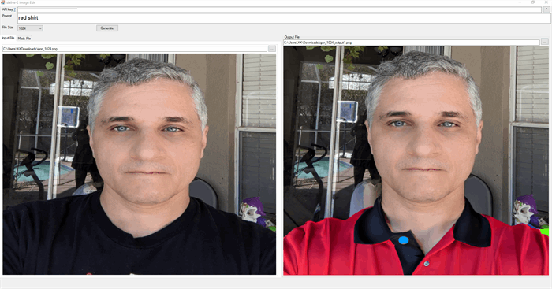
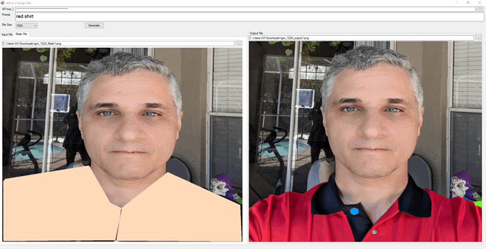

This an AI Image Editor that uses OpenAI dall-e-2 API. It allows replace some areas of a pre-existing image based on a text prompt.

Originally posted here: 
<https://www.codeproject.com/Articles/5385564/OpenAI-Image-Editor/>

### Introduction
This application is my attempt to create a smallest client app to edit images using OpenAI dall-e-2 API.  The app lets you replace some areas of a pre-existing image based on a text prompt. 

The image has to be a square PNG file with three  sizes: 256x256, 512x512, or 1024x1024.  The application will convert your image tile to this format and size using ResizeImage() function.

Next the app will let you create a mask file by drawing shapes (ploygons) on top of the uploaded image.

After typing the prompt click Generate button to have the output file created.

### Using the code
First get OpenAI Key https://platform.openai.com/api-keys.

Here is the code. Basically, it uses HttpClient to multi-part post request to OpenAI using this function SendMultipartHttpRequest to this Endpoint: https://api.openai.com/v1/images/edits

### Points of Interest
You can read more about the OpenAI API in this article: https://platform.openai.com/docs/api-reference/images/create
